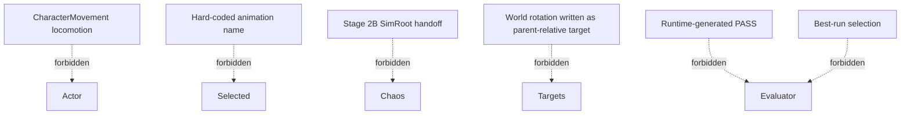

# Stage 2A Runtime Architecture

## Product dataflow

```mermaid
flowchart LR
    Script[Locked scripted intent] --> Shell[Bridge-owned kinematic shell]
    Shell --> Actor[Actor world transform]
    Script --> Trajectory[Pose Search trajectory predictor]
    Actor --> Trajectory
    MeshFacing[Skeletal-mesh world facing] --> Trajectory
    Trajectory --> Search[Pose Search database query]
    Search --> Selected[Selected animation and time]
    Selected --> Sampler[Animation asset sampler]
    Sampler --> MannyPose[Manny current/future bone poses]
    MannyRest[Manny rest-frame cache] --> Canonical[Canonical Manny-to-SMPL adapter]
    MannyPose --> Canonical
    ChaosCurrent[Current Chaos body state] --> CurrentAdapter[UE world to Proto canonical current state]
    CurrentAdapter --> Tensors[Self observation and mimic target tensors]
    Canonical --> Tensors
    Terrain[Chaos terrain samples] --> Tensors
    Tensors --> ONNX[PHC ONNX policy]
    ONNX --> Decode[Action conditioning and Proto action decode]
    MannyNeutral[Manny neutral/bind calibration] --> Decode
    Decode --> Targets[Parent-relative Physics Control targets]
    Targets --> Chaos[Chaos simulated humanoid]
    Chaos --> ChaosCurrent
    Actor --> Tracking[Root-shell tracking evidence]
    Chaos --> Tracking
    Tracking --> Evaluator[Versioned protocol evaluator]
    Tensors --> Evidence[Raw policy evidence]
    Targets --> Evidence
    Shell --> Evidence
    Chaos --> Evidence
    Evidence --> Evaluator
```

## Authority ownership

| Concern | Sole authority |
|---|---|
| Global route translation and yaw | Bridge-owned Stage 2A shell |
| Reference animation selection | Pose Search |
| Policy inputs | Canonical observation/tensor builders |
| Local joint intent | ONNX policy output |
| Action conditioning and embodiment mapping | Proto-to-Manny action adapter |
| Published joint target | Physics Control target composer |
| Body movement | Chaos simulation, except the explicitly kinematic root/shell authority |
| Product verdict | Versioned external evaluator over raw evidence |

No evidence flag, debug trace, render setting, or evaluator threshold may change runtime behavior.

## Forbidden shortcuts

## Architectural seams to extract

The current implementation concentrates several responsibilities in `UPhysAnimComponent`. Extraction should follow semantic boundaries, not merely split source files:

1. **Trajectory adapter** — actor/mesh world intent to the exact Pose Search query contract.
2. **Reference sampler** — selected asset/time to identity-origin and mesh-placed pose samples.
3. **Canonical pose adapter** — Manny pose/rest data to canonical SMPL bodies.
4. **Policy tensor builder** — canonical current/future state to fixed tensor layouts.
5. **Action embodiment adapter** — Proto actions to Manny parent-relative targets.
6. **Shell tracking observer** — actor-local initial offset to world physical-root tracking evidence.
7. **Protocol fixture** — consumes a locked schedule and emits raw evidence without interpreting success.

Each seam should have a pure or deterministic contract test before integration tests and full Chaos episodes.

## Stage boundary

Stage 2A ends at causal physical reference tracking under kinematic route authority. Stage 2B begins only when a separate protocol grants some global root or center-of-mass authority to the simulated body. The two stages may share policy and embodiment adapters, but must not share implicit authority transitions.
